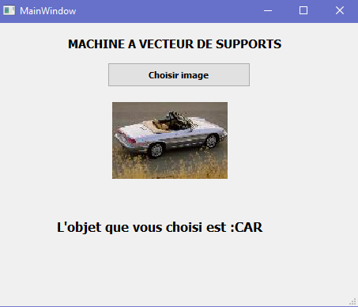
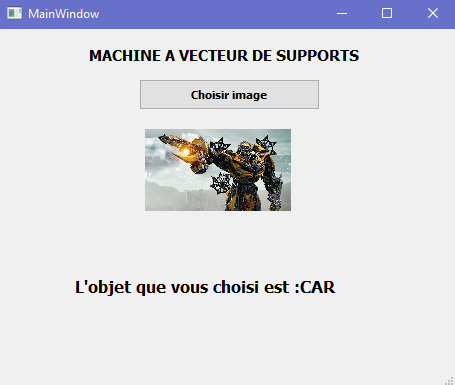
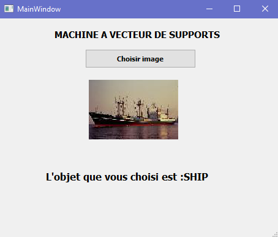
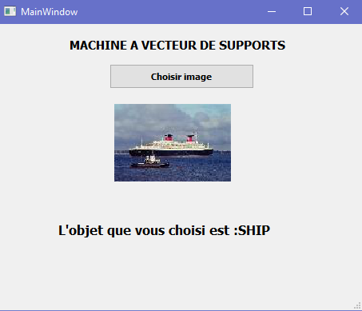

# SVM

## Données

Une base d’images contient 490 images pour l’apprentissage (400 voitures et 90 bateaux), et encore 21 images pour fait des tests.

## Prétraitements

Chaque image doit passer par la séquence des traitements suivantes.

1. Conversion l’image au niveau de gris
2. Binarisation (Noir et blanc)
3. Redimensionnement (120*80)
4. Conversion la matrice de l’image au vecteur
5. Insertion se vecteur dans une matrice (images)
6. Insertion dans un autre vecteur le nom de l’objet (Y).

## Le Classifier utilisé

J’ai utilisé un classifier SVM de la bibliothèque *sklearn*, instancier avec une noyaux linaire et un paramètre de régularisation égal à 1.2,

## Les résultats

Le temps d'exécution pour l’apprentissage sur 490 images est égal à **0.9839940071105957**.
Le taux de reconnaissance sur la base d'Apprentissage est **100%**.
Le taux de reconnaissance sur la base de Test est **100%**.

## Les tests

